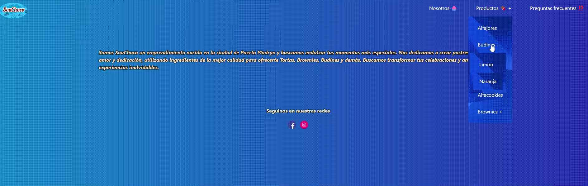

# SouChoco


<div>


<br>
<br>

<br>


<br>
</div>
<br>

## Índice

- [Introducción](#introducción)
- [Elementos](#elementos)
- [Instalación](#instalación)
- [Despedida](#despedida)

# Introducción

<p align="justify">
El objetivo es hacer una página informativa del emprendimiento diciendo que se hace y los productos que ofrece.
</p>

## Elementos

- Python 3.13.2
- Django versión 4.2.14

##### Página para descargar Python:

<a> https://www.python.org/downloads/ </a>

## Instalación

```bash
#Clonar el repositorio:
git clone https://github.com/aguspacheco/RegisterUser.git

#Crear el entorno virtual:
python3 -m venv <venv>

#Activar el entorno virtual en windows:
source <venv>/Scripts/activate

#Activar el entorno virtual en linux:
source <venv>\Scripts\activate

#Acceder al proyecto
cd VeSEP/

#Instalar las dependencias
pip install django
pip install pillow

#Instalar datos Json
python manage.py loaddata datos.json

#Realizar las migraciones
python manage.py makemigrations
python manage.py migrate

#Crear un superusuario
python manage.py createsuperuser

#Ejecutar el proyecto
python manage.py runserver

```

# Despedida

Gracias por visitar el sitio informativo!!!.

</div>
